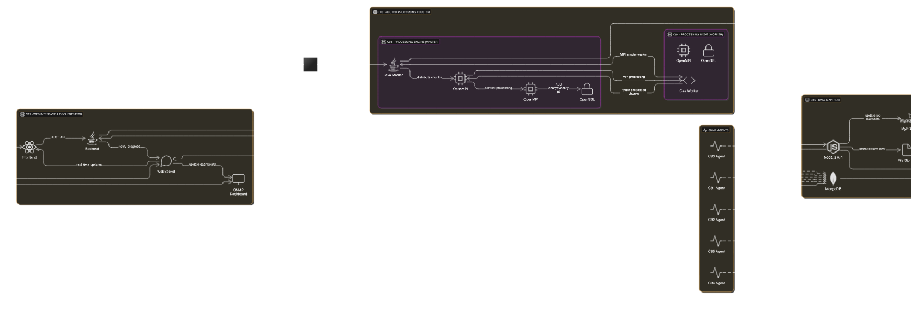

# Sistem Distribuit de Criptare/Decriptare BMP cu Monitorizare SNMP



## Descriere Generală

Acest proiect implementează un sistem distribuit complet pentru criptarea și decriptarea fișierelor BMP folosind algoritmul **AES** cu suport pentru chei de **128, 192 și 256 de biți** în modurile **ECB** și **CBC**. Sistemul este construit pe o arhitectură de **5 containere Docker** interconectate prin **RabbitMQ** și **RESTful APIs** incluzând monitorizare SNMP în timp real.

**🎯 Funcționalitate principală**: Sistemul poate cripta și decripta **orice fișier BMP**, indiferent de dimensiune.

> **Notă**: Am testat personal doar până la fișiere de **1GB** pentru a nu umple spațiul de stocare, dar folosind scriptul `helpers/create_bmp.py` puteți genera și testa fișiere și mai mari!

## Arhitectura sistemului

### Componente principale

#### **C01 - Web Interface & Orchestrator**

- **Backend**: Java (Javalin framework) + RabbitMQ Publisher
- **Frontend**: React + Material-UI
- **Responsabilități**:
  - Interfață web responsivă pentru upload/download fișiere BMP
  - Împărțirea fișierelor mari în chunk-uri de 512KB pentru procesare distribuită
  - Orchestrarea job-urilor prin RabbitMQ
  - WebSocket pentru notificări în timp real
  - Dashboard de monitorizare SNMP

#### **C02 - Message Broker & SNMP Coordinator**

- **Tehnologie**: RabbitMQ (cu Management Plugin)
- **Responsabilități**:
  - Broker de mesaje pentru comunicarea asincronă între containere

#### **C03 - Distributed Processing Engine**

- **Tehnologie**: Java + OpenMPI + OpenMP + OpenSSL
- **Responsabilități**:
  - Procesare distribuită folosind **MPI (Message Passing Interface)**
  - Procesare paralelă folosind **OpenMP** pentru optimizare pe thread-uri
  - Implementarea algoritmilor AES ECB/CBC pentru criptare/decriptare
  - Gestionarea chunk-urilor și reconstruirea fișierelor mari

#### **C04 - Secondary Processing Node**

- **Tehnologie**: C++ + OpenMPI + OpenSSL
- **Responsabilități**:
  - Nod secundar pentru procesare distribuită MPI
  - Backup pentru procesarea în paralel
  - Scalabilitate orizontală a capacității de procesare

#### **C05 - Data & API Hub**

- **Tehnologie**: Node.js (Express) + MySQL + MongoDB
- **Responsabilități**:
  - **MySQL**: Stocare metadate job-uri și statistici SNMP
  - **MongoDB**: Stocare metrici SNMP și date de monitorizare
  - API RESTful pentru managementul datelor
  - Endpoint-uri pentru upload/download fișiere BMP
  - Dashboard pentru vizualizarea statisticilor și metricilor SNMP

## Fluxul de procesare

### 1. Upload și Inițializare Job

```
User Upload BMP → C01 Frontend → C01 Backend → RabbitMQ → C03
```

1. **Frontend (React)**: Utilizatorul uploadează un fișier BMP și selectează operația (criptare/decriptare), algoritmul (AES-128/192/256) și modul (ECB/CBC)
2. **C01 Backend**: Validează fișierul, îl divide în chunk-uri de 512KB și publică job-ul în RabbitMQ
3. **RabbitMQ**: Direcționează mesajele către cozile corespunzătoare
4. **C03**: Consumă mesajele și inițializează procesarea distribuită

### 2. Procesare Distribuită MPI + OpenMP

```
C03 (Master) ↔ C04 (Worker)
     ↓
  OpenMP Parallelization
     ↓
  AES Encryption/Decryption
```

1. **C03** acționează ca **Master Node** în topologia MPI
2. **C04** acționează ca **Worker Node** pentru procesare distribuită
3. Fiecare nod folosește **OpenMP** pentru paralelizarea pe thread-uri
4. **OpenSSL** implementează algoritmii AES cu chei generate securizat

### 3. Stocare și Gestionare Date

```
Processed Chunks → C05 MySQL (metadata) + File Storage
SNMP Metrics → C05 MongoDB (time-series data)
```

1. **MySQL**: Stochează metadatele job-urilor și statisticile SNMP
2. **File System**: Stochează fișierele procesate
3. **MongoDB**: Stochează metrici SNMP pentru monitorizare și analiză

### 4. Monitorizare SNMP în Timp Real

```
All Containers → SNMP Agents → C05 MongoDB → Frontend Dashboard
```

1. Fiecare container rulează un **agent SNMP** pentru colectarea metricilor
2. Fiecare agent colectează date la fiecare 30 de secunde printr-un apel curl la un endpoint SNMP.
3. Datele sunt stocate în **MongoDB**.
4. **Frontend** afișează dashboard-ul cu metrici în timp real

## Tehnologii și Algoritmi Utilizați

### Criptografie și Securitate

- **AES (Advanced Encryption Standard)**:
  - **AES-128**: Chei de 128 biți pentru performanță optimă
  - **AES-192**: Echilibru între securitate și performanță
  - **AES-256**: Securitate maximă pentru date sensibile
- **Moduri de Operare**:
  - **ECB (Electronic Codebook)**: Simplu, dar nerecomandat pentru date repetitive din cauza mecanismului de criptare
  - **CBC (Cipher Block Chaining)**: Securizat, folosește un vector de inițializare (IV) pentru fiecare bloc bazat pe blocul anterior
- **OpenSSL**: Implementare optimizată pentru criptografie

### Procesare Distribuită și Paralelă

- **OpenMPI**: Framework pentru procesare distribuită pe clustere
  - Comunicație inter-proces eficientă
  - Gestionarea toleranței la erori
  - Scalabilitate dinamică
- **OpenMP**: Paralelizare pe thread-uri pentru CPU multi-core
  - Paralelizarea buclelor de procesare
  - Gestionarea automată a thread pool-ului
  - Optimizări pentru memoria cache

### Infrastructură și comunicare

- **Docker & Docker Compose**: Containerizare și orchestrare
- **RabbitMQ**: Message broker AMQP pentru comunicare asincronă
  - Exchange-uri tipizate pentru rutare inteligentă
  - Durabilitate și persistență mesaje
  - Dead letter queues pentru error handling
- **SNMP (Simple Network Management Protocol)**: Monitorizare infrastructură
  - Collectare automată de metrici sistem
  - Time-series storage în MongoDB
  - Alerting și dashboard-uri vizuale

### Frontend și API

- **React**: Single Page Application cu componente funcționale
- **Material-UI**: Design system modern și responsive
- **WebSockets**: Notificări în timp real pentru progresul job-urilor
- **RESTful API**: Endpoint-uri standardizate pentru toate operațiile

### Stocare și Baze de Date

- **MySQL**: Bază de date relațională pentru metadate structurate
  - Scheme normalizate pentru job-uri și utilizatori
  - Tranzacții ACID pentru consistență
  - Indexare pentru performanță
- **MongoDB**: Bază de date NoSQL pentru metrici time-series
  - Flexibilitate pentru structuri de date variabile
  - Agregare și analytics performante
  - Horizontal scaling capabilities

## Structura proiectului

```
project/
├── docker-compose.yaml           # Orchestrare multi-container
├── helpers/
│   ├── create_bmp.py            # Generator fișiere BMP de test
│   ├── collect_metrics.sh       # Script colectare SNMP
│   └── diff.py                  # Utilitar comparare fișiere
├── c01/                         # Web Interface & Orchestrator
│   ├── Dockerfile
│   ├── backend/                 # Java Javalin + RabbitMQ
│   │   ├── pom.xml
│   │   └── src/main/java/com/ase/ism/wcdad/
│   └── frontend/                # React + Material-UI
│       ├── package.json
│       └── src/
├── c02/                         # RabbitMQ + SNMP Coordinator
│   ├── Dockerfile
│   └── entrypoint.sh
├── c03/                         # Distributed Processing Engine
│   ├── Dockerfile
│   ├── native_app/
│   │   └── process_image.cpp    # C++ MPI + OpenMP + AES
│   └── src/main/java/           # Java Consumer + Orchestrator
├── c04/                         # Secondary Processing Node
│   ├── Dockerfile
│   └── native_app/
│       └── process_image.cpp    # C++ MPI Worker
└── c05/                         # Data & API Hub
    ├── Dockerfile
    ├── api/                     # Node.js Express API
    │   ├── routes/
    │   │   ├── jobs.js
    │   │   ├── pictures.js
    │   │   └── snmp.js
    │   ├── db.js                # MySQL connection
    │   └── mongo.js             # MongoDB connection
    └── db/
        ├── mysql-init/          # Schema și privileges
        └── mongo-init/          # Indexes și collections
```

## Rulare și testare

### Cerințe de sistem

- Docker instalat
- Minimum 8GB RAM și 4 CPU cores pentru performanță optimă
- Port-uri disponibile: 3000, 5672, 8080, 15672, 27017, 3306

### Quick Start

```bash
# Clonare repository
git clone https://github.com/zeekliviu/ism-wcas-dpss-project.git
cd project

# Build și start toate containerele
docker-compose up --build

# Accesare interfață web
# Frontend: http://localhost:8080
# RabbitMQ Management: http://localhost:15672 (user:password)
# API Direct: http://localhost:3000
```

### Generare fișiere BMP de test

```bash
# Generare fișier BMP de 10MB pentru test
python helpers/create_bmp.py 10MB

# Generare fișier BMP de 1GB (pentru brave souls!)
python helpers/create_bmp.py 1GB

# Comparare fișiere după criptare/decriptare
python helpers/diff.py original.bmp decrypted.bmp
```

## Teste și Validare

### Teste funcționale

1. **Upload** fișier BMP de diferite dimensiuni (1KB - 1GB testat)
2. **Criptare** cu AES-128/192/256 în modurile ECB/CBC
3. **Decriptare** și verificare integritate vs. original
4. **Procesare paralelă** pe multiple chunk-uri simultan

### Teste de performanță

- **Viteză**: ~50MB/s pentru AES-256-CBC pe hardware standard
- **Latență**: <2s overhead pentru setup MPI și chunking
- **Scalabilitate**: Procesarea se îmbunătățește linear cu numărul de noduri MPI
